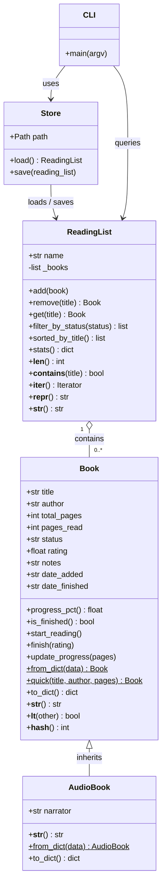

# 📚 BookTracker CLI

> A command-line personal reading list manager — built as a Python Module 8 capstone.

[](https://www.python.org/)
[](LICENSE)
[]()

---

## Purpose

BookTracker lets any developer manage their reading list entirely from the terminal.
Add books, track pages, mark them done, record star ratings, and view statistics —
all persisted as a plain JSON file you fully control. No account, no cloud, no ads.

**Who is it for?**  
Anyone comfortable in a terminal who wants a zero-friction reading log that lives
alongside their dotfiles.

---

## Install

```bash
# 1 — clone
git clone https://github.com/iamwaqarjaved/booktracker-cli.git
cd booktracker-cli

# 2 — install (editable mode — works from a fresh clone)
pip install -e .

# 3 — confirm
booktracker --help
```

**Requirements:** Python 3.10 or later · no external runtime dependencies.

---

## Quick Start

```bash
# Add books
booktracker add "Clean Code" "Robert C. Martin" 431
booktracker add "The Pragmatic Programmer" "Hunt & Thomas" 352
booktracker add "Atomic Habits" "James Clear" 291 --audio --narrator "Pete Larkin"

# Start reading and track progress
booktracker start "Clean Code"
booktracker progress "Clean Code" 215

# Finish with a rating
booktracker start "The Pragmatic Programmer"
booktracker finish "The Pragmatic Programmer" --rating 4.8

# Add a note
booktracker note "Clean Code" "Functions should do one thing — love this rule."

# View everything
booktracker list
booktracker list --status done
booktracker stats
```

---

## Usage Reference

```
booktracker [--store FILE] [-v] COMMAND [options]

Commands:
  add        Add a book (--audio --narrator for audiobooks)
  start      Mark a book as currently reading
  progress   Update pages read
  finish     Mark a book as done  [--rating 0-5]
  remove     Remove a book
  list       Show all books       [--status to-read|reading|done] [--sort]
  stats      Aggregate statistics
  note       Append a note to a book
```

**Global flags**

| Flag | Description |
|---|---|
| `--store FILE` | Override default store path (`~/.booktracker/books.json`) |
| `-v / --verbose` | Enable DEBUG logging |

---

## Screenshots

### `booktracker list`

```
📚  4 book(s)
────────────────────────────────────────────────────────────────────────────────────
Title                            Author                 Status       Progress Rating
────────────────────────────────────────────────────────────────────────────────────
Clean Code                       Robert C. Martin       reading        49.9%       —
The Pragmatic Programmer         Hunt & Thomas          done          100.0%   4.8 ★
Designing Data-Intensive Applic  Martin Kleppmann       to-read         0.0%       —
Atomic Habits                    James Clear            to-read         0.0%       —
────────────────────────────────────────────────────────────────────────────────────
```

### `booktracker stats`

```
📈  Reading Statistics
──────────────────────────────
  Total books     : 4
  Done            : 1
  Reading now     : 1
  To read         : 2
  Pages in list   : 1,685
  Pages read      : 567
  Avg rating      : 4.80 ★
──────────────────────────────
```

### `booktracker add` with audiobook flag

```
✅  Added: [TO-READ ] Atomic Habits — James Clear (0.0%) [narr. Pete Larkin] 🎧
```

---

## Architecture Overview

### Class Diagram



### Module Map

```
src/booktracker/
├── __init__.py      package entry point, version
├── models.py        Book, AudioBook, ReadingList, recursive helpers
├── store.py         JSON persistence (load / save)
└── cli.py           argparse interface, sub-command handlers
```

### Data Flow

```
User types: booktracker finish "Clean Code" --rating 4.5
                │
                ▼
           cli.py: _build_parser() → parse args
                │
                ▼
           _handle_finish(args, store)
                │
           store.load() ──► reads ~/.booktracker/books.json ──► ReadingList
                │
           rl.get("Clean Code") → Book
           book.finish(rating=4.5)  ← business logic in model
                │
           store.save(rl) ──► writes updated JSON back to disk
                │
                ▼
           🎉  Finished: [DONE] Clean Code — Robert C. Martin (100.0%  ★ 4.5)
```

---

## Concepts Demonstrated (Weeks 1–8)

| Week | Concept | Where |
|---|---|---|
| 1 | Variables, types, expressions | `models.py` fields, `store.py` |
| 2 | Control flow, loops | `cli.py` list handlers, `store.py` |
| 3 | Functions, scope | `_sum_pages`, `_sum_pages_read` |
| 4 | Collections (list, dict) | `ReadingList._books`, `to_dict` |
| 5 | File I/O, error handling | `Store.load` / `Store.save` |
| 6 | Classes, OOP basics | `Book`, `ReadingList` |
| 7 | Inheritance, `@dataclass`, `@classmethod`, `@property` | `AudioBook`, `Book.from_dict`, `Book.progress_pct` |
| 8 | Dunder methods | `__str__`, `__lt__`, `__hash__`, `__len__`, `__contains__`, `__iter__` |

---

## Running Tests

```bash
pip install pytest
pytest tests/ -v
# 29 passed
```

---

## Project Structure

```
booktracker-cli/
├── src/
│   └── booktracker/
│       ├── __init__.py
│       ├── models.py
│       ├── store.py
│       └── cli.py
├── tests/
│   ├── test_models.py
│   └── test_cli.py
├── pyproject.toml
├── requirements.txt
├── PROJECT_BRIEF.md
├── ARCHITECTURE_DECISIONS.md
└── README.md
```

---

## Demo Screencast

> **5-minute walkthrough:** install → add books → track progress → finish with
> rating → view list + stats → inspect JSON store.
>
> 📹 _[Link to be added before final submission]_

---

## Credits

Built by **Waqar Javed** as the Module 8 capstone for a Python course.  
IEEE Senior Member · Founder, Safe Labs AI Inc.  
GitHub: [@iamwaqarjaved](https://github.com/iamwaqarjaved)

---

## License

MIT — see [LICENSE](LICENSE).
