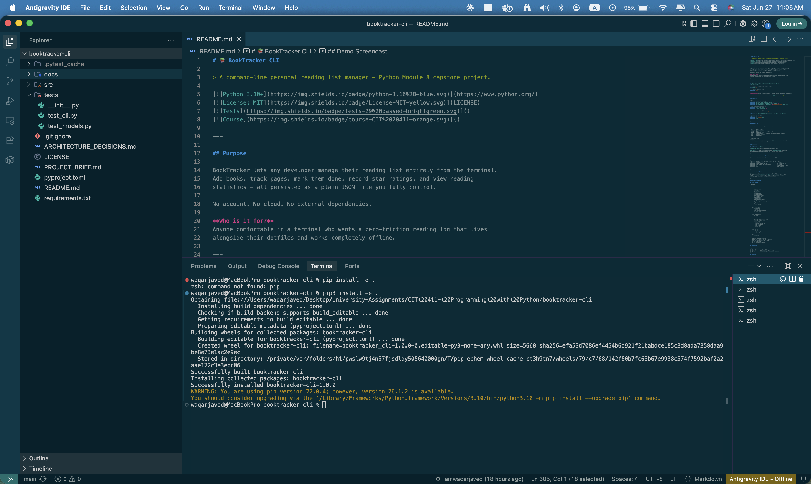
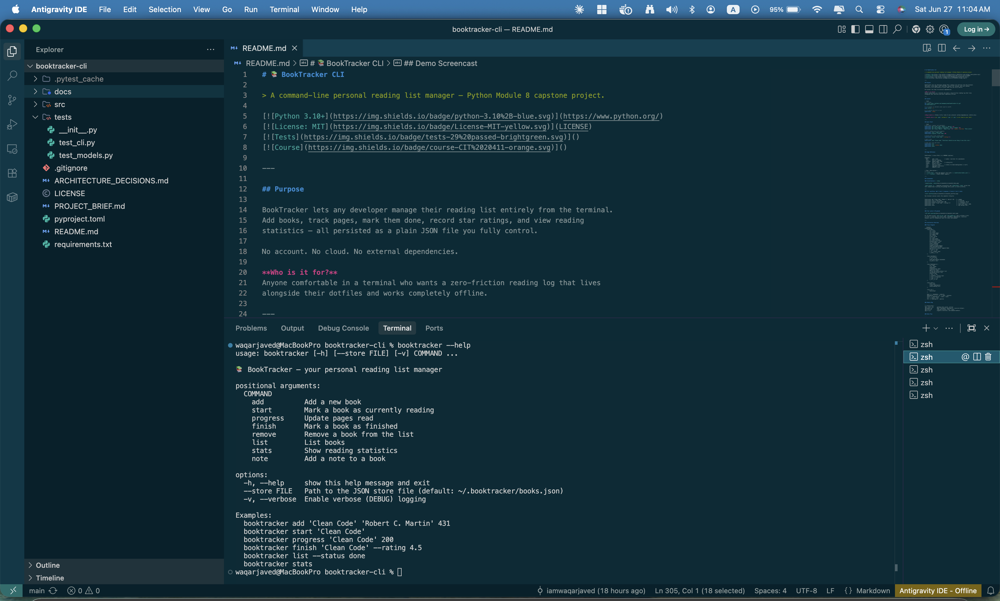
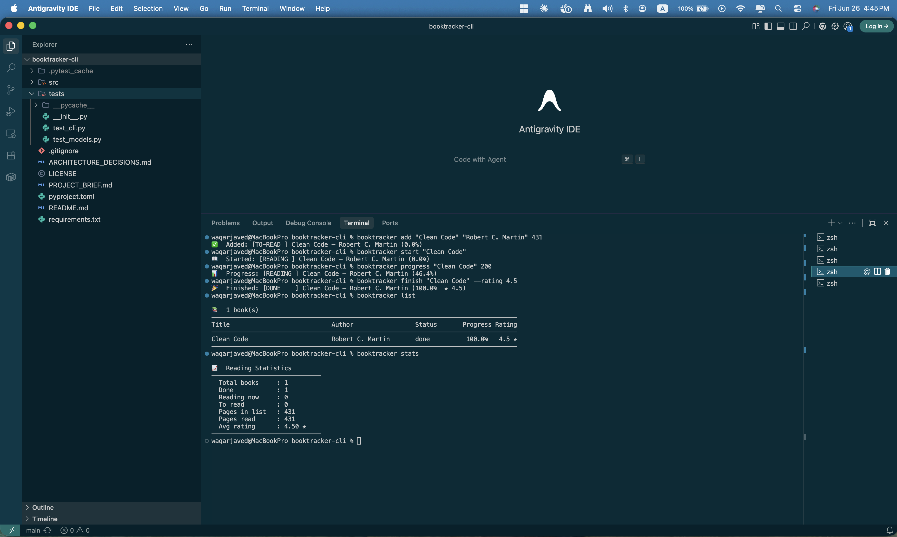
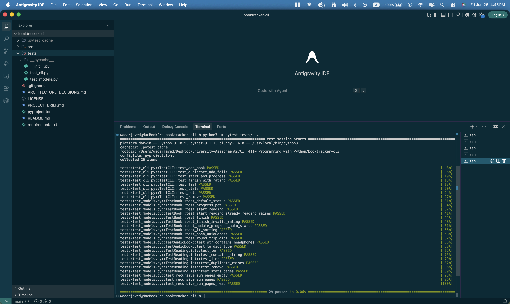
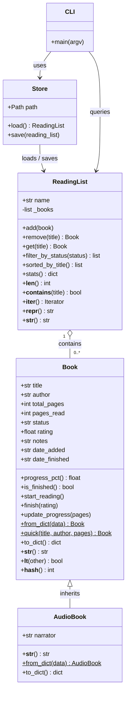

# 📚 BookTracker CLI

> A command-line personal reading list manager — Python Module 8 capstone project.

[](https://www.python.org/)
[](LICENSE)
[]()
[]()

---

## Purpose

BookTracker lets any developer manage their reading list entirely from the terminal.
Add books, track pages, mark them done, record star ratings, and view reading
statistics — all persisted as a plain JSON file you fully control.

No account. No cloud. No external dependencies.

**Who is it for?**
Anyone comfortable in a terminal who wants a zero-friction reading log that lives
alongside their dotfiles and works completely offline.

---

## Install

```bash
# 1 — clone
git clone https://github.com/iamwaqarjaved/booktracker-cli.git
cd booktracker-cli

# 2 — install in editable mode (pip3 on macOS)
pip3 install -e .

# 3 — confirm the CLI is live
booktracker --help
```

**Requirements:** Python 3.10 or later · zero external runtime dependencies (stdlib only).

> **macOS note:** use `pip3` instead of `pip` if `pip` is not found in your shell.

---

## Quick Start

```bash
# Add books (regular and audiobook)
booktracker add "Clean Code" "Robert C. Martin" 431
booktracker add "The Pragmatic Programmer" "Hunt & Thomas" 352
booktracker add "Atomic Habits" "James Clear" 291 --audio --narrator "Pete Larkin"

# Start reading and track progress
booktracker start "Clean Code"
booktracker progress "Clean Code" 200

# Finish with a star rating (0–5)
booktracker finish "Clean Code" --rating 4.5

# Add a note
booktracker note "Clean Code" "Functions should do one thing — love this rule."

# View your list and stats
booktracker list
booktracker list --status done
booktracker stats
```

---

## Usage Reference

```
booktracker [--store FILE] [-v] COMMAND [options]

Commands:
  add        Add a book           (--audio --narrator for audiobooks)
  start      Mark as reading
  progress   Update pages read
  finish     Mark as done         [--rating 0-5]
  remove     Delete from list
  list       Show all books       [--status to-read|reading|done] [--sort]
  stats      Aggregate statistics
  note       Append a note
```

| Flag | Description |
|---|---|
| `--store FILE` | Override default store path (`~/.booktracker/books.json`) |
| `-v / --verbose` | Enable DEBUG logging |

---

## Screenshots

### Installation & `--help`




`pip3 install -e .` completes successfully and `booktracker --help` prints the
full command menu — proving the package entry point is wired correctly.

---

### Full workflow: add → start → progress → finish → list → stats



One terminal session covers the complete lifecycle:

```
booktracker add "Clean Code" "Robert C. Martin" 431   →  ✅ Added
booktracker start "Clean Code"                         →  📖 Started
booktracker progress "Clean Code" 200                  →  📊 Progress: 46.4%
booktracker finish "Clean Code" --rating 4.5           →  🎉 Finished ★ 4.5
booktracker list                                       →  table with done / 100%
booktracker stats                                      →  Avg rating 4.50 ★
```

---

### Test suite — 29 passed



All 29 tests across `test_cli.py` and `test_models.py` pass on Python 3.10.5
in 0.06 s — covering unit tests (Book, AudioBook, ReadingList, recursive
helpers) and CLI integration tests for every sub-command.

---

## Architecture Overview

### Class Diagram



### Module Map

```
src/booktracker/
├── __init__.py      package entry point, version
├── models.py        Book, AudioBook, ReadingList, recursive helpers
├── store.py         JSON persistence (load / save)
└── cli.py           argparse interface, sub-command handlers
```

### Data Flow

```
User types: booktracker finish "Clean Code" --rating 4.5
                │
                ▼
           cli.py  →  _build_parser() parses args
                │
                ▼
           _handle_finish(args, store)
                │
           store.load() ──► reads ~/.booktracker/books.json ──► ReadingList
                │
           rl.get("Clean Code") → Book
           book.finish(rating=4.5)   ← business logic lives in the model
                │
           store.save(rl) ──► writes updated JSON back to disk
                │
                ▼
           🎉  Finished: [DONE] Clean Code — Robert C. Martin (100.0%  ★ 4.5)
```

---

## Concepts Demonstrated (Weeks 1–8)

| Week | Concept | Location |
|---|---|---|
| 1 | Variables, types, f-strings | `models.py` fields, `cli.py` output |
| 2 | Control flow, loops | `cli.py` handlers, `store.py` |
| 3 | Functions, scope, parameters | `_sum_pages`, `_sum_pages_read` |
| 4 | Lists, dicts, comprehensions | `ReadingList._books`, `to_dict()` |
| 5 | File I/O, error handling, logging | `Store.load()` / `Store.save()` |
| 6 | Classes, OOP basics | `Book`, `ReadingList` |
| 7 | Inheritance, `@dataclass`, `@classmethod`, `@property` | `AudioBook`, `Book.from_dict`, `Book.progress_pct` |
| 8 | Dunder methods | `__str__` `__lt__` `__hash__` `__len__` `__contains__` `__iter__` |

### Dunder Method Inventory (9 total — spec minimum: 5)

| Dunder | Class | Purpose |
|---|---|---|
| `__init__` | `Book` (via @dataclass) | Field initialisation |
| `__repr__` | `Book` (via @dataclass), `ReadingList` | Debug string |
| `__str__` | `Book`, `AudioBook`, `ReadingList` | Human-readable display |
| `__eq__` | `Book` (via @dataclass) | Value equality |
| `__lt__` | `Book` | Enables `sorted(books)` by title |
| `__hash__` | `Book` | Set / dict key support |
| `__len__` | `ReadingList` | `len(rl)` → book count |
| `__contains__` | `ReadingList` | `"title" in rl` |
| `__iter__` | `ReadingList` | `for book in rl:` |

---

## Running Tests

```bash
pip3 install pytest
python3 -m pytest tests/ -v
```

Expected output: `29 passed in 0.06s`

---

## Project Structure

```
booktracker-cli/
├── src/
│   └── booktracker/
│       ├── __init__.py
│       ├── models.py
│       ├── store.py
│       └── cli.py
├── tests/
│   ├── __init__.py
│   ├── test_models.py
│   └── test_cli.py
├── docs/
│   └── screenshots/
│       ├── screenshot_help.png
│       ├── screenshot_workflow.png
│       └── screenshot_tests.png
├── pyproject.toml
├── requirements.txt
├── PROJECT_BRIEF.md
├── ARCHITECTURE_DECISIONS.md
├── LICENSE
└── README.md
```

---

## Demo Screencast

> **5-minute walkthrough:** install → add books → track progress → finish with
> rating → view list + stats → inspect raw JSON store.
>
> 📹 _[Link to be added before final submission]_

---

## Credits

Built by **Waqar Javed** as the Module 8 capstone — Programming with Python.  
IEEE Senior Member · Founder, [Safe Labs AI Inc.](https://agentsafelabs.com)  
GitHub: [@iamwaqarjaved](https://github.com/iamwaqarjaved)

---

## License

MIT — see [LICENSE](LICENSE).